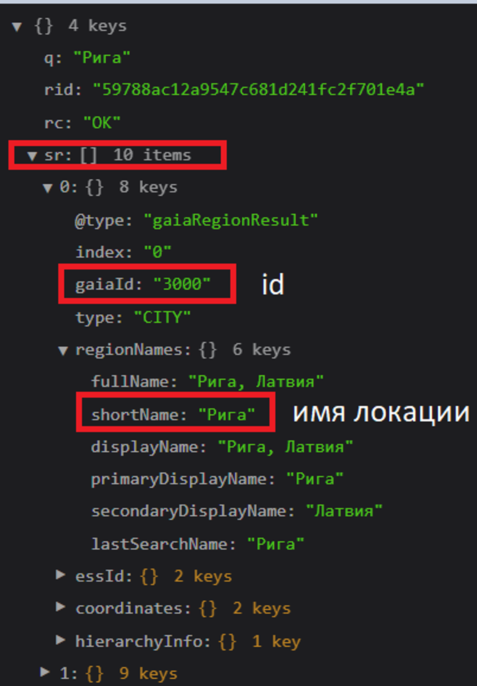
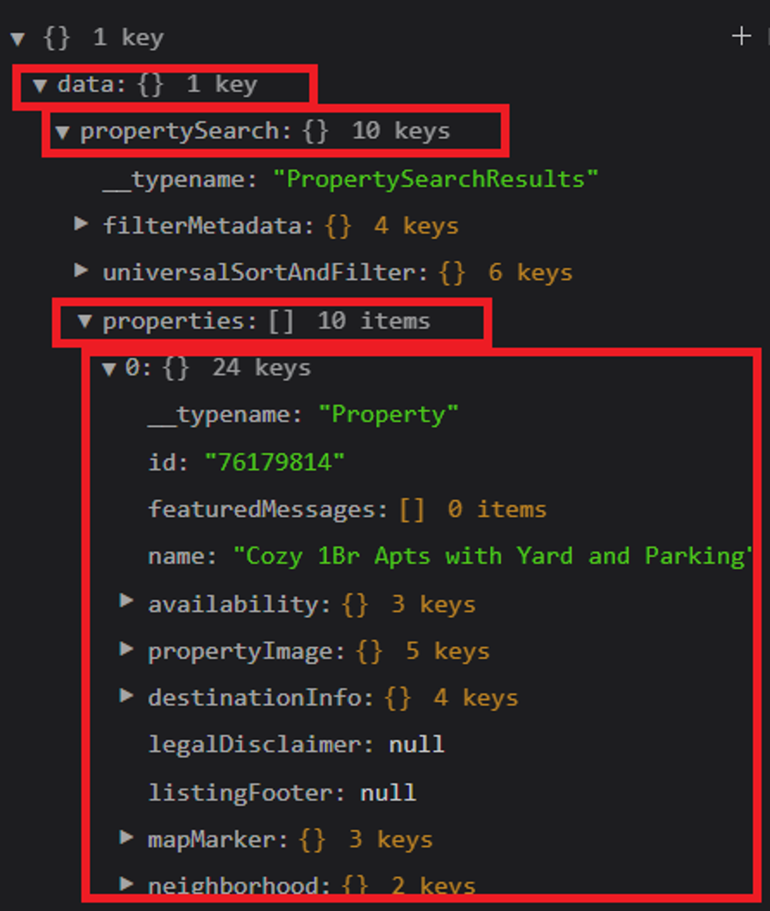
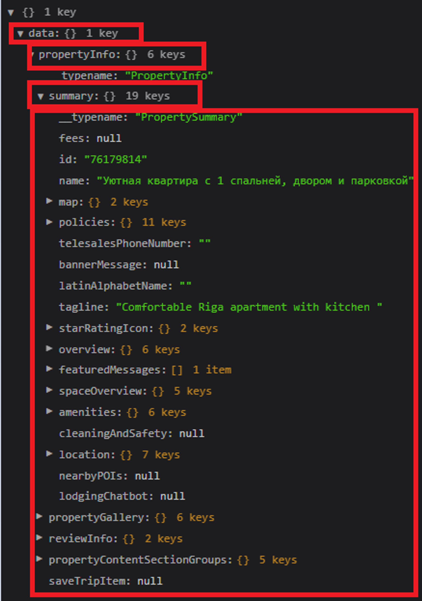

# Телеграм бот по поиску и бронированию отелей
___
Данный бот призван упростить поиск и бронирование отелей, а также сделать этот процесс более удобным, благодаря переносу необходимого функционала с сайта в месседжер.

**Команды:**
- /start - приветствие, запуск бота
- /help - помощь с командами доступными в боте
- /history - история запросов
- /city - выбрать город поездки
- /date - выбрать дату поездки

Эти же команды доступны с использованием инлайн или реплай кнопок

**\*запросы делаются в расчёте на одного человека**

**Статус: прототип**

## Содержание
___
- [Этабы разработки](#этапы-разработки)
- [Технологии](#технологии)
- [Использование](#использование)
- [Разработка](#разработка)
- [To do](#to-do)
- [Команда проекта](#команда-проекта)
- [Источники](#источники)

## Этапы разработки
**1. Создание архитектуры бота**

**2. Настройка реакции бота на конкретные команды (start, help, city, date, history)**

**4. Создание базы данных для хранения истории запросов пользователя**

**5. Написание и тестирование функций API в консоле в test.py в корневой папке**

**6. Перенос функций в бота**

**7. Проверка работы всех команд**

**8. Подключение бота к базе данных (удаление test.py в корневой папке)**

**9. Создание и добавление кнопок**

**10. Повторная проверка работоспособности бота и всех его команд, доработка функционала (добавление даты, времени и прочих мелочей)**

_10.1. Попросить знакомых людей протестировать бота для устранения недостатков и получения фидбека (опционально)_

**11. Заполнение источников и используемых сторонних библиотек в requirements.txt**


## Технологии
___
- [Python3](https://www.python.org/)
- [PyCharm](https://www.jetbrains.com/ru-ru/pycharm/)
- [Telegram](https://telegram.org/)

## Использование
___
Для работы бота необходимо
1) зарегестрировать бота через [BotFather](https://t.me/BotFather) и получить токен бота. 
2) Зарегестрироваться на [Rapid](https://rapidapi.com/) и получить [X-RapidAPI-Key](https://rapidapi.com/apidojo/api/hotels4).
3) Создать файл .env в [config_data](config_data) по примеру из файла [.env.template](.env.template)
4) Добавить BOT_TOKEN и RAPID_API_KEY в файл .env
5) Создать локальное окружение (загрузить необходимые фреймворки из [requirements.txt](requirements.txt)
   *  см. Требования -> Установка дополнительных библиотек
6) Запустите файл main.py для активации бота

**Бот запущен. Его можно использовать**

Для поиска отелей
1) Откройте [Telegram](https://telegram.org/) и найдите своего бота (по тегу, указанному вами при регистрации)
   
    1.1) Получить тег и имя бота можно повторно, для этого нужно перейти в диалог с  [BotFather](https://t.me/BotFather) и ввести команду /mybots
2) Введите команду /start
3) Следуйте дальнейшним инструкциям бота

### RapidApi endpoint’s
Данный [API](https://rapidapi.com/apidojo/api/hotels4/) предоставляет 3 эндпоинта:
1) locations/v3/search - предоставляет ответ по выбранной локации из которого нужно вытянуть `id` локации
2) properties/v2/list - предоставляет ответ с информацией по отелям: id отеля,название, цена. Ожидает от вас `id` локации
3) properties/v2/detail - предоставляет ответ с подробной информацией об отеле: точный адрес, фотографии. Ожидает от вас `id` отеля

### Примеры запроса для поиска отелей:

#### Получении локации GET запрос к [`https://hotels4.p.rapidapi.com/locations/v3/search`](https://hotels4.p.rapidapi.com/locations/v3/search)

С передачей параметров как
```python
{'q': 'Рига', 'locale': 'ru_RU'}
```
Из него в группе `CITY` - `type:"CITY"` можно выбрать нужный `Id` - `gaiaId` для будущего запроса `properties/v2/list` 



#### Получение отелей POST запрос к [`https://hotels4.p.rapidapi.com/properties/v2/list`](https://hotels4.p.rapidapi.com/properties/v2/list)
```python
payload = {'currency': 'USD',
           'eapid': 1,
           'locale': 'ru_RU',
           'siteId': 300000001,
           'destination': {
               'regionId': '3000' # id из первого запроса
           },
           'checkInDate': {'day': 7, 'month': 12, 'year': 2022},
           'checkOutDate': {'day': 9, 'month': 12, 'year': 2022},
           'rooms': [{'adults': 1}],
           'resultsStartingIndex': 0,
           'resultsSize': 10,
           'sort': 'PRICE_LOW_TO_HIGH',
           'filters': {'availableFilter': 'SHOW_AVAILABLE_ONLY'}
           }
```



#### Получении подробной информации об отеле POST запрос к [`https://hotels4.p.rapidapi.com/properties/v2/detail`](https://hotels4.p.rapidapi.com/properties/v2/detail)



## Разработка
___

### Требования
Для установки и запуска проекта, необходим [Python3](https://www.python.org/).

### Создание виртуального окружения
* откройте терминал
* найдите каталог с файлом бота в терминале
* введите следующую команду:
```sh
$ python3 -m venv venv
```
* после создания виртуального окружения подключитесь к нему слудующей командой

linux/macOS:
```sh
$ source venv/bin/activate 
```
windows:
```sh
$ venv\Scripts\activate  
```

### Установка дополнительных библиотек
Для установки дополнительных библиотек, выполните команду:
```sh
$ pip install -r requirements.txt
```


## Команда проекта
___

- [Дмитрий](https://t.me/ewbtofuhyaaoasuiryb) — Разработчик
- [Александр Мордвинов]() — Куратор проекта


## Источники
___
- [Пример написания README.md](https://gist.github.com/bzvyagintsev/0c4adf4403d4261808d75f9576c814c2#file-readme-md)
- [Пример работы с состояниями бота](https://github.com/eternnoir/pyTelegramBotAPI/blob/master/examples/custom_states.py)
- [venv](https://sky.pro/media/kak-sozdat-virtualnoe-okruzhenie-python/)
- [pip freeze](https://sky.pro/media/ustanovka-paketov-s-pomoshhyu-pip-v-sootvetstvii-s-fajlom-requirements-txt-iz-lokalnogo-kataloga/)
- [rapid api, API Hotels](https://rapidapi.com/apidojo/api/hotels4)